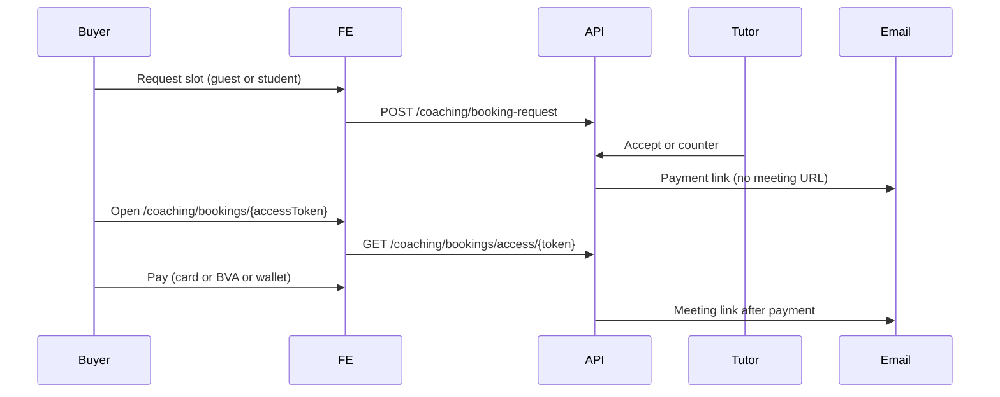

# Coaching 1-on-1 booking (guest + student) & digital download discounts

**Base:** `/api/marketplace`

**Scope:** Hybrid **booking requests** only (not group sessions on `GET /coaching/sessions`). For public group-session browse, use existing coaching browse docs.

**Related:** `md/GUEST_CHECKOUT_FRONTEND.md`, `md/BVA_STORE_COURSE_FRONTEND.md`

---

## Digital download discounts

Same model as courses.

### Tutor dashboard (create / update product)

**POST** `/tutor/digital-downloads` · **PUT** `/tutor/digital-downloads/:id`

Optional body fields:

- `discount_percent` (0–100)
- `discount_starts_at` / `discount_ends_at` (ISO timestamps, optional window)

List price stays in `price` / `price_usd`. Public APIs expose:

| Field | Meaning |
|--------|---------|
| `list_price` | Original price |
| `price` | **Effective sale price** (use for display & checkout) |
| `discount_percent` | Active discount % (0 if inactive) |
| `discount_active` | Whether discount applies now |

Applies on: digital browse/detail, store browse, public tutor store, **guest checkout** (`POST /guest-checkout`), and logged-in digital purchase.

**Backend migration (ops):** `node scripts/migrate-digital-download-discount.js`

---

## Coaching booking — overview



1. Buyer submits a **booking request** (logged-in **student** or **guest**).
2. Tutor **accepts** or **counter-proposes**; buyer may **accept counter** (guest needs `access_token`).
3. Status becomes **`accepted`** → backend emails a **payment link** (not the video/meeting URL).
4. Buyer pays within **`payment_due_at`** (`expires_at`, ~30 minutes after accept).
5. After payment → session is created → backend emails **meeting link** (`view_link` / session page).

---

## Submit booking request

**POST** `/coaching/booking-request`

**Auth:** optional (`optionalAuthorize`)

### Logged-in student

Send student JWT. Body:

```json
{
  "tutor_id": 12,
  "tutor_type": "sole_tutor",
  "topic": "React performance",
  "description": "Optional details",
  "category": "Technology & Data",
  "proposed_start_time": "2026-10-15T14:00:00.000Z",
  "proposed_end_time": "2026-10-15T15:00:00.000Z",
  "duration_minutes": 60,
  "student_note": "Optional"
}
```

### Guest (no account)

No JWT. Required:

```json
{
  "guest_email": "ada@example.com",
  "guest_name": "Ada Lovelace",
  "guest_phone": "+2348012345678",
  "tutor_id": 12,
  "tutor_type": "sole_tutor",
  "topic": "React performance",
  "proposed_start_time": "2026-10-15T14:00:00.000Z",
  "proposed_end_time": "2026-10-15T15:00:00.000Z"
}
```

**Response:** `data.booking` includes `id`, `status` (`pending`), `access_token`, `is_guest`, times, `estimated_price`, `currency`.

**Store `access_token`** for guests (localStorage / email link). Students also receive `access_token` for the public pay page if they pay while logged out.

**Discovery (unchanged):** `GET /coaching/tutors`, `GET /coaching/tutors/:tutorId` — public, optional JWT.

---

## Tutor side (creator app)

| Action | Method | Path |
|--------|--------|------|
| List requests | GET | `/tutor/coaching/booking-requests` |
| Detail | GET | `/tutor/coaching/booking-requests/:id` |
| Accept | POST | `/tutor/coaching/booking-requests/:id/accept` |
| Decline | POST | `/tutor/coaching/booking-requests/:id/decline` |
| Counter time | POST | `/tutor/coaching/booking-requests/:id/counter` |

On **accept**, buyer gets payment email. UI should show `final_price`, `payment_due_at`.

---

## Buyer: accept counter-proposal

**POST** `/coaching/booking-request/:id/accept-counter`

**Auth:** optional

- **Student:** JWT (must own booking).
- **Guest:** body `{ "access_token": "<from create response or email>" }`.

Triggers same **payment email** as tutor accept.

**Decline counter:** `POST /coaching/booking-request/:id/decline-counter` (student JWT today).

**Student list:** `GET /coaching/my-booking-requests` (JWT).

**Cancel pending:** `POST /coaching/booking-request/:id/cancel` (JWT).

---

## Public pay page (learner app)

**Suggested route:** `/coaching/bookings/:accessToken`  
(Matches email link shape: `{FRONTEND_URL}/coaching/bookings/{accessToken}`.)

### Load booking

**GET** `/coaching/bookings/access/:accessToken`

No auth. Response `data` includes:

- `topic`, tutor summary, agreed times, `final_price`, `currency`
- `status`, `paid`, `can_pay`, `payment_due_at`
- `session_id` when already paid
- `payment` when `can_pay` — Flutterwave inline payload + `methods[]` (card + BVA)

Use `can_pay` to show/hide pay UI. If `paid`, show confirmation and “check email for meeting link” (or deep-link to session when you have `session_id`).

---

## Payment methods (after `accepted`, before `paid`)

### 1. Card (Flutterwave inline)

**POST** `/coaching/bookings/:id/init-payment`

**Auth:** optional

```json
{
  "access_token": "required for guest if no JWT"
}
```

Returns `data.payment` (`tx_ref`, `amount`, `public_key`, `methods`).

After Flutterwave success:

**POST** `/coaching/bookings/:id/confirm-payment`

```json
{
  "access_token": "guest",
  "transaction_reference": "from Flutterwave",
  "flutterwave_transaction_id": "optional"
}
```

Webhook may also fulfill; confirm endpoint gives immediate UX.

### 2. Bank transfer (BVA)

From `payment.methods`, BVA entry includes:

- `source`: `"coaching_booking"`
- `booking_id`
- `access_token` (guest)

**POST** `/payments/bva`

```json
{
  "source": "coaching_booking",
  "booking_id": 42,
  "access_token": "guest-only-if-no-JWT"
}
```

Student with JWT can omit `access_token` if they own the booking.

Show returned virtual account details. Then:

**POST** `/payments/bva/confirm`

```json
{
  "source": "coaching_booking",
  "transaction_reference": "<tx_ref>"
}
```

**NGN only** for BVA. Same pattern as guest digital / courses — see `md/BVA_STORE_COURSE_FRONTEND.md`.

### 3. Wallet (students only)

Requires student JWT. No public token.

**GET** `/coaching/booking/:id/payment-preview` — wallet balance, `can_afford`, shortfall.

**POST** `/coaching/booking/:id/process-payment` — debits wallet and creates session in one step.

Logged-in students can use either public pay page + card/BVA **or** wallet endpoints.

---

## Guest account linking

If a guest pays with `guest_email` and later **registers/logs in** with the same email, backend links the booking/session to the student account. No extra FE call required; optional refresh of “my sessions” after login.

---

## UI checklist

| Screen | Behavior |
|--------|----------|
| Book tutor | Guest form vs student form; same API |
| Pending | Show awaiting tutor; guest keeps `access_token` |
| Counter | Guest accept with `access_token` in body |
| Accepted | Direct user to pay page; explain email sent |
| Pay page | `GET .../access/:token`; respect `payment_due_at` |
| Paid | No pay button; meeting email sent by backend |
| Digital product cards | Show `list_price` struck through when `discount_active`; checkout uses `price` (sale) |

**Do not** send users to `POST /guest-checkout` for coaching — guest checkout is **digital downloads only**.

**Do not** show meeting / Stream join URL on the accept email — only after payment.

---

## Ops migrations (production)

```bash
node scripts/migrate-digital-download-discount.js
node scripts/migrate-coaching-booking-guest.js
```

---

## Quick reference

| Goal | Endpoint |
|------|----------|
| Guest/student book | POST `/coaching/booking-request` |
| Public pay view | GET `/coaching/bookings/access/:accessToken` |
| Start card pay | POST `/coaching/bookings/:id/init-payment` |
| Confirm card pay | POST `/coaching/bookings/:id/confirm-payment` |
| BVA | POST `/payments/bva` · confirm `/payments/bva/confirm` (`source: coaching_booking`) |
| Wallet pay | POST `/coaching/booking/:id/process-payment` |
| Accept counter (guest) | POST `/coaching/booking-request/:id/accept-counter` + `access_token` |
