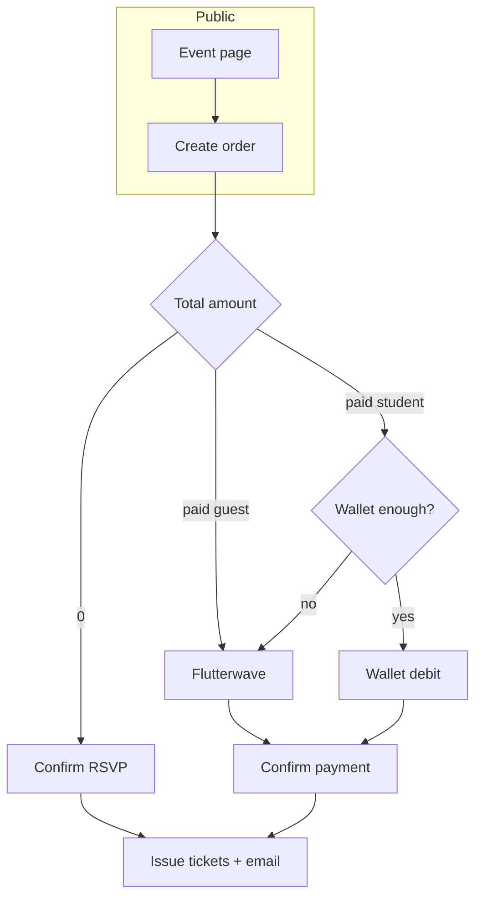

# Event Ticket Sales — Frontend Implementation Guide

## Document status

**Implemented on backend** (May 2026). Endpoints below match live routes under `/api/marketplace`. Run migration before first use:

```bash
node scripts/migrate-create-event-ticket-tables.js
```

**Note:** Public event detail uses `GET /events/slug/:slug` (not `/events/:slug`).

**Base URL:** `https://<api-host>/api/marketplace`

**Related docs:** `TUTOR_DASHBOARD_API.md`, `DIGITAL_DOWNLOADS_FRONTEND_GUIDE.md`, `HYBRID_COACHING_BOOKING_FRONTEND_GUIDE.md`, `FLUTTERWAVE_SETUP.md`

---

## Table of contents

1. [Overview](#overview)
2. [Locked product decisions](#locked-product-decisions)
3. [Authentication](#authentication)
4. [Conventions](#conventions)
5. [Domain model & enums](#domain-model--enums)
6. [User flows](#user-flows)
7. [Tutor & organization endpoints](#tutor--organization-endpoints)
8. [Public discovery & event pages](#public-discovery--event-pages)
9. [Checkout & orders (guest + student)](#checkout--orders-guest--student)
10. [Tickets & magic links](#tickets--magic-links)
11. [Check-in (day-of)](#check-in-day-of)
12. [Sales pages & storefront](#sales-pages--storefront)
13. [Payments (Flutterwave)](#payments-flutterwave)
14. [Commission & earnings (deferred)](#commission--earnings-deferred)
15. [Error handling](#error-handling)
16. [Frontend screens checklist](#frontend-screens-checklist)
17. [MVP vs later](#mvp-vs-later)
18. [Testing checklist](#testing-checklist)

---

## Overview

Tutors and **organizations** can create **ticketed events** (webinars, workshops, in-person meetups, hybrid). Buyers purchase or RSVP **without requiring a student account** — email + name is enough. Logged-in students get the same flow with tickets linked to their profile.

Events are a **new marketplace product** (`product_type: "event"`). They are **not** coaching sessions.

### Key capabilities (MVP)

| Capability | Supported |
|------------|-----------|
| Online / in-person / hybrid events | Yes |
| Multiple ticket tiers per event | Yes |
| Free RSVP tiers (`price = 0`) | Yes |
| Paid tiers (card via Flutterwave for guests; wallet or card for students) | Yes |
| Guest checkout (email) | Yes |
| Organization-branded events | Yes |
| Inventory (no overselling) | Yes |
| QR / code check-in for tutors | Yes |
| Platform commission on orders | **Deferred** — fields present, calculation TBD |

---

## Locked product decisions

| Topic | Decision |
|-------|----------|
| Event format | **Online, in-person, and hybrid** |
| Buyers | **Anyone with a valid email** (guest checkout); optional student login |
| Pricing | **Free RSVP and paid tiers** on the same event |
| Commission | **Decided later** — store gross amounts; `commission_rate` / `tutor_earnings` may be `null` until policy is set |
| Organizations | **Yes** — org accounts and permitted org users manage org events |

---

## Authentication

| Role | Header | Notes |
|------|--------|-------|
| **Tutor** (sole tutor or organization account) | `Authorization: Bearer <tutor_jwt>` | Full event management |
| **Organization user** | `Authorization: Bearer <org_user_jwt>` | Only if backend grants `manage_events` (or shared `manage_products`) on that org |
| **Student** | `Authorization: Bearer <student_jwt>` | Optional at checkout; enables wallet pay + **My tickets** |
| **Public / guest** | None | Browse events, RSVP, pay with Flutterwave |
| **Magic link (ticket holder)** | `X-Ticket-Access-Token: <order_access_token>` **or** query `?token=` on ticket URLs | No login; scoped to one order |

**Tutor JWT** is obtained from existing marketplace login routes (`/api/marketplace/login/sole-tutor`, organization login, etc.) — see `TUTOR_DASHBOARD_API.md`.

**Student JWT** from `/api/auth/student/login` or universal `/api/auth/login`.

---

## Conventions

### Response shape

Success:

```json
{
  "success": true,
  "message": "Human-readable message",
  "data": { }
}
```

Error (typical):

```json
{
  "success": false,
  "message": "Error description",
  "statusCode": 400
}
```

### Pagination

List endpoints accept:

| Query | Default | Max |
|-------|---------|-----|
| `page` | `1` | — |
| `limit` | `20` | `100` |

Paginated `data` includes:

```json
{
  "items": [],
  "pagination": {
    "page": 1,
    "limit": 20,
    "total": 45,
    "total_pages": 3
  }
}
```

### Money

- Amounts are **decimal strings or numbers** with 2 decimal places in JSON (e.g. `"5000.00"`).
- `currency` is ISO-like codes already used in marketplace: `NGN`, `USD`, etc.
- Display currency conversion for students may follow existing wallet/course purchase behavior when logged in.

### Slugs

- Event public URL: `/events/{slug}` (frontend route).
- API public fetch: `GET /events/:slug`.
- Slugs are unique globally (or per owner — backend will document; assume **global unique** for MVP).

### Timezones

- All event datetimes are stored in UTC; API returns ISO 8601 strings.
- Event includes `timezone` (IANA, e.g. `Africa/Lagos`) for display on UI.

### Idempotency

For order creation and payment confirm, send:

```
Idempotency-Key: <uuid-v4>
```

Same key + same payload returns the same order (no duplicate charges).

---

## Domain model & enums

### Event `format`

| Value | Meaning |
|-------|---------|
| `online` | Virtual only; `online_url` revealed after purchase/RSVP |
| `in_person` | Physical venue |
| `hybrid` | Both venue and online link |

### Event `status`

| Value | Tutor can edit? | Public visible? |
|-------|-----------------|-----------------|
| `draft` | Yes | No |
| `published` | Limited fields | Yes (if `sales_end` not passed) |
| `sold_out` | Auto or manual | Yes (waitlist later) |
| `cancelled` | No (terminal) | Shows cancelled banner |
| `completed` | No | Archive / read-only |

### Ticket tier

| Field | Notes |
|-------|-------|
| `price` | `0` = free RSVP; still consumes inventory |
| `quantity_total` | Hard cap |
| `quantity_sold` | Confirmed tickets |
| `quantity_reserved` | Held during pending checkout (expires ~15 min) |
| `max_per_order` | e.g. 4 |
| `sales_start` / `sales_end` | Optional window |

### Order `status`

| Value | UI |
|-------|-----|
| `pending` | Awaiting payment (paid tiers) |
| `paid` | Confirmed; tickets issued |
| `failed` | Payment failed |
| `cancelled` | User/tutor cancelled before event |
| `refunded` | Money returned (policy-dependent) |

### Ticket `status`

| Value | Meaning |
|-------|---------|
| `valid` | Can check in |
| `used` | Checked in |
| `cancelled` | Voided |

---

## User flows

### Tutor / organization — create and sell

```
1. Create event (draft) + venue/online details
2. Add ticket tiers (free and/or paid)
3. Publish event
4. Share public URL or sales page slug
5. Monitor sales dashboard + export attendees
6. Day-of: check-in via QR scan or code lookup
7. After event: status → completed (manual or auto by end_time)
```

### Guest buyer — free RSVP

```
1. Open public event page
2. Select tier (price 0) + quantity
3. Form: email, name, phone (optional)
4. POST order → immediate confirm (no Flutterwave)
5. Email with magic link + ticket codes
6. Ticket page shows QR per seat
```

### Guest buyer — paid

```
1. Open public event page
2. Select paid tier + quantity
3. Form: email, name, phone (optional)
4. POST order → pending + reservation
5. Initialize Flutterwave (tx_ref tied to order)
6. On success: POST confirm-payment OR webhook completes order
7. Email + magic link ticket page
```

### Logged-in student

Same as guest; additionally:

- Pass `Authorization` header on order create (links `student_id`).
- Paid: may use **wallet** if balance sufficient (`payment_method: "wallet"`), else Flutterwave.
- **GET /my-tickets** lists all orders.



---

## Tutor & organization endpoints

**Prefix:** `/api/marketplace/tutor/events`  
**Auth:** `Authorization: Bearer <tutor_jwt>`

> Organization accounts use the same routes; `owner_type` / `owner_id` are inferred from JWT. Organization **users** need permission — if API returns `403`, hide event management in UI.

### Upload event cover image

```
POST /tutor/events/upload-cover
Content-Type: multipart/form-data
```

| Field | Type | Required |
|-------|------|----------|
| `cover_image` | file | Yes |

**Response `data`:**

```json
{
  "cover_image_url": "https://...",
  "file_path": "tutors/123/events/covers/..."
}
```

---

### Create event

```
POST /tutor/events
Content-Type: application/json
```

**Body:**

```json
{
  "title": "JavaScript Masterclass 2026",
  "description": "Full-day workshop...",
  "format": "hybrid",
  "timezone": "Africa/Lagos",
  "starts_at": "2026-06-15T09:00:00.000Z",
  "ends_at": "2026-06-15T17:00:00.000Z",
  "doors_open_at": "2026-06-15T08:30:00.000Z",
  "venue_name": "Lagos Tech Hub",
  "address_line1": "12 Admiralty Way",
  "city": "Lagos",
  "region": "Lagos State",
  "country": "NG",
  "latitude": 6.454,
  "longitude": 3.394,
  "online_url": "https://zoom.us/j/...",
  "cover_image_url": "https://...",
  "category": "Technology",
  "refund_policy": "full_before_48h",
  "refund_policy_text": "Full refund if cancelled 48h before start.",
  "max_attendees": 200,
  "slug": "javascript-masterclass-2026"
}
```

| Field | Required | Notes |
|-------|----------|-------|
| `title` | Yes | |
| `format` | Yes | `online` \| `in_person` \| `hybrid` |
| `timezone` | Yes | IANA |
| `starts_at` / `ends_at` | Yes | `ends_at` > `starts_at` |
| `online_url` | If online/hybrid | Hidden on public page until ticket issued |
| Venue fields | If in_person/hybrid | |
| `slug` | No | Auto-generated from title if omitted |

**Response `data.event`:** includes `id`, `status: "draft"`, `owner_type`, `owner_id`, timestamps.

---

### List my events

```
GET /tutor/events?page=1&limit=20&status=published&search=javascript&format=online
```

| Query | Description |
|-------|-------------|
| `status` | `draft`, `published`, `sold_out`, `cancelled`, `completed` |
| `search` | Title / slug |
| `format` | Filter by format |
| `from` / `to` | Filter by `starts_at` range (ISO date) |

**Response `data`:** paginated `events[]` with summary: `tickets_sold`, `gross_revenue`, `tier_count`.

---

### Get event (tutor detail)

```
GET /tutor/events/:id
```

Includes nested `tiers[]`, sales summary, and `recent_orders` (last 10, optional).

---

### Update event

```
PUT /tutor/events/:id
```

Same body fields as create (partial update supported). Cannot change `owner_*`. Restricted fields when `status` is `published` (e.g. cannot reduce `quantity_total` below sold + reserved).

---

### Publish / unpublish

```
POST /tutor/events/:id/publish
POST /tutor/events/:id/unpublish
```

Publish requires at least one tier with `quantity_total > 0`.

---

### Cancel event

```
POST /tutor/events/:id/cancel
```

**Body (optional):**

```json
{
  "reason": "Speaker unavailable",
  "notify_attendees": true,
  "refund_paid_orders": true
}
```

Triggers cancellation emails; paid order refunds per policy (backend/async).

---

### Ticket tiers — CRUD

```
POST   /tutor/events/:eventId/tiers
GET    /tutor/events/:eventId/tiers
GET    /tutor/events/:eventId/tiers/:tierId
PUT    /tutor/events/:eventId/tiers/:tierId
DELETE /tutor/events/:eventId/tiers/:tierId
```

**Create tier body:**

```json
{
  "name": "General Admission",
  "description": "Standard entry",
  "price": "5000.00",
  "currency": "NGN",
  "quantity_total": 100,
  "max_per_order": 4,
  "sales_start": "2026-05-01T00:00:00.000Z",
  "sales_end": "2026-06-14T23:59:59.000Z",
  "sort_order": 1,
  "is_hidden": false
}
```

Free tier: `"price": "0.00"`.

**Tier response includes:** `quantity_available` (computed), `quantity_sold`, `quantity_reserved`.

Delete tier only if no sold tickets.

---

### Sales dashboard

```
GET /tutor/events/:id/sales?from=2026-01-01&to=2026-12-31
```

**Response `data`:**

```json
{
  "summary": {
    "orders_count": 42,
    "tickets_sold": 87,
    "gross_revenue": "435000.00",
    "currency": "NGN",
    "free_rsvp_count": 15,
    "paid_order_count": 27,
    "commission_status": "pending_config"
  },
  "by_tier": [
    {
      "tier_id": 1,
      "tier_name": "General Admission",
      "tickets_sold": 60,
      "gross_revenue": "300000.00"
    }
  ],
  "revenue_by_day": [
    { "date": "2026-05-10", "orders": 5, "gross_revenue": "25000.00" }
  ]
}
```

When commission is configured, add `platform_fee`, `tutor_earnings` to summary.

---

### Attendees list

```
GET /tutor/events/:id/attendees?page=1&limit=50&tier_id=1&checked_in=true
```

**Response `data.items[]`:**

```json
{
  "ticket_id": 901,
  "ticket_code": "EVT-ABC123",
  "status": "valid",
  "tier_name": "VIP",
  "holder_name": "Jane Doe",
  "holder_email": "jane@example.com",
  "order_id": 55,
  "purchased_at": "2026-05-10T12:00:00.000Z",
  "checked_in_at": null
}
```

---

### Export attendees (CSV)

```
GET /tutor/events/:id/attendees/export
```

Returns `Content-Type: text/csv` file download. Same filters as list endpoint.

---

### Orders list (tutor)

```
GET /tutor/events/:id/orders?page=1&status=paid
```

For support desk / finance view.

---

## Public discovery & event pages

**Auth:** None (optional `Authorization` for “already purchased” hints on student).

### Browse events

```
GET /events?page=1&limit=20&format=online&category=Technology&from=2026-06-01&search=javascript
```

Only `published` events not ended (unless `include_past=true`).

**Response card fields:** `id`, `slug`, `title`, `format`, `starts_at`, `timezone`, `cover_image_url`, `venue_name`, `city`, `country`, `min_price`, `currency`, `is_free_available`, `tickets_remaining` (nullable if unlimited).

---

### Get public event by slug

```
GET /events/:slug
```

**Response `data`:**

```json
{
  "event": {
    "id": 10,
    "slug": "javascript-masterclass-2026",
    "title": "JavaScript Masterclass 2026",
    "description": "...",
    "format": "hybrid",
    "timezone": "Africa/Lagos",
    "starts_at": "2026-06-15T09:00:00.000Z",
    "ends_at": "2026-06-15T17:00:00.000Z",
    "doors_open_at": "2026-06-15T08:30:00.000Z",
    "cover_image_url": "https://...",
    "category": "Technology",
    "status": "published",
    "refund_policy": "full_before_48h",
    "refund_policy_text": "...",
    "venue": {
      "venue_name": "Lagos Tech Hub",
      "address_line1": "12 Admiralty Way",
      "city": "Lagos",
      "region": "Lagos State",
      "country": "NG",
      "latitude": 6.454,
      "longitude": 3.394
    },
    "host": {
      "owner_type": "organization",
      "owner_id": 3,
      "display_name": "Acme Learning Org",
      "slug": "acme-learning",
      "logo_url": "https://..."
    }
  },
  "tiers": [
    {
      "id": 1,
      "name": "Early Bird",
      "description": "...",
      "price": "4000.00",
      "currency": "NGN",
      "quantity_available": 12,
      "max_per_order": 4,
      "sales_start": "2026-05-01T00:00:00.000Z",
      "sales_end": "2026-06-01T00:00:00.000Z",
      "is_sales_open": true
    },
    {
      "id": 2,
      "name": "Free RSVP",
      "price": "0.00",
      "quantity_available": 50,
      "max_per_order": 2,
      "is_sales_open": true
    }
  ],
  "user_context": {
    "is_logged_in": false,
    "existing_order_id": null,
    "tickets_owned": 0
  }
}
```

**Never expose** `online_url` on this endpoint.

---

### Events by tutor/org storefront

```
GET /public/tutor/:slug/events
GET /public/organization/:slug/events
```

Same card shape as browse list, filtered by host.

---

## Checkout & orders (guest + student)

### Create order

```
POST /events/:eventId/orders
Content-Type: application/json
Idempotency-Key: <uuid>
```

**Auth:** Optional. If student JWT present, `student_id` is linked.

**Body:**

```json
{
  "buyer_email": "jane@example.com",
  "buyer_name": "Jane Doe",
  "buyer_phone": "+2348012345678",
  "items": [
    { "tier_id": 1, "quantity": 2 },
    { "tier_id": 2, "quantity": 1 }
  ],
  "payment_method": "flutterwave",
  "holder_names": ["Jane Doe", "John Doe", "Jane Doe"]
}
```

| Field | Required | Notes |
|-------|----------|-------|
| `buyer_email` | Yes | Validated; confirmation sent here |
| `buyer_name` | Yes | |
| `items` | Yes | At least one line |
| `payment_method` | Paid only | `flutterwave` \| `wallet` (wallet requires student auth) |
| `holder_names` | No | Length must equal total ticket count; defaults to `buyer_name` |

**Response — free / fully covered (total = 0):**

```json
{
  "success": true,
  "message": "RSVP confirmed",
  "data": {
    "order": {
      "id": 55,
      "status": "paid",
      "total_amount": "0.00",
      "currency": "NGN",
      "ticket_count": 3
    },
    "access_token": "opaque-magic-link-token",
    "tickets_url": "/tickets/order/opaque-magic-link-token",
    "tickets": [
      { "id": 901, "ticket_code": "EVT-ABC123", "tier_name": "Early Bird" }
    ]
  }
}
```

**Response — paid (pending):**

```json
{
  "success": true,
  "message": "Order created",
  "data": {
    "order": {
      "id": 56,
      "status": "pending",
      "total_amount": "8000.00",
      "currency": "NGN",
      "ticket_count": 2,
      "reservation_expires_at": "2026-05-10T12:15:00.000Z"
    },
    "payment": {
      "provider": "flutterwave",
      "tx_ref": "evt-order-56-abc123",
      "amount": "8000.00",
      "currency": "NGN",
      "public_key": "FLWPUBK_TEST-...",
      "meta": {
        "order_id": 56,
        "event_id": 10,
        "buyer_email": "jane@example.com"
      }
    }
  }
}
```

**Errors to handle in UI:**

| Status | Message scenario |
|--------|------------------|
| `400` | Tier sold out, sales window closed, `max_per_order` exceeded |
| `409` | Inventory conflict (refresh tiers) |
| `410` | Reservation expired — restart checkout |

---

### Initialize payment (alternative explicit step)

If create order does not return Flutterwave payload:

```
POST /events/orders/:orderId/payment/initialize
```

Same `payment` object as above. Only for `status: "pending"`.

---

### Confirm payment (client after Flutterwave success)

```
POST /events/orders/:orderId/confirm-payment
Content-Type: application/json
```

**Body:**

```json
{
  "transaction_reference": "evt-order-56-abc123",
  "flutterwave_transaction_id": "1234567890"
}
```

At least one reference required. Backend verifies with Flutterwave (same pattern as `POST /api/wallet/fund`).

**Response:** same as free order success (`status: "paid"`, `access_token`, `tickets[]`).

**Student wallet payment:**

```
POST /events/orders/:orderId/pay-with-wallet
Authorization: Bearer <student_jwt>
```

No Flutterwave; immediate `paid` if balance sufficient.

---

### Get order status (polling)

```
GET /events/orders/:orderId/status
```

Optional auth or `?access_token=` for guest. Used while waiting for webhook.

```json
{
  "data": {
    "order_id": 56,
    "status": "paid",
    "access_token": "..."
  }
}
```

---

### Cancel pending order (guest/student)

```
POST /events/orders/:orderId/cancel
```

Only `pending` orders; releases reservation.

---

## Tickets & magic links

### View order tickets (guest)

```
GET /tickets/order/:accessToken
```

**Auth:** `accessToken` from email link (opaque, unguessable). No JWT.

**Response `data`:**

```json
{
  "order": {
    "id": 55,
    "status": "paid",
    "buyer_email": "jane@example.com",
    "event": {
      "title": "JavaScript Masterclass 2026",
      "starts_at": "2026-06-15T09:00:00.000Z",
      "timezone": "Africa/Lagos",
      "format": "hybrid",
      "venue": { "venue_name": "...", "city": "..." },
      "online_url": "https://zoom.us/j/...",
      "calendar_links": {
        "google": "https://calendar.google.com/...",
        "ics_download_url": "/tickets/order/.../calendar.ics"
      }
    }
  },
  "tickets": [
    {
      "id": 901,
      "ticket_code": "EVT-ABC123",
      "status": "valid",
      "tier_name": "Early Bird",
      "holder_name": "Jane Doe",
      "qr_payload": "base64-or-signed-string-for-frontend-qr"
    }
  ]
}
```

`online_url` only present when order is `paid` and event is online/hybrid.

---

### Download calendar file

```
GET /tickets/order/:accessToken/calendar.ics
```

---

### Student — my tickets

```
GET /my-tickets?upcoming=true&page=1
Authorization: Bearer <student_jwt>
```

Lists orders linked to student. Each item includes `event` summary, `ticket_count`, `access_token` for detail page (or embed tickets inline).

---

### Resend confirmation email

```
POST /tickets/order/:accessToken/resend-email
```

Rate-limited. Body optional: `{ "email": "jane@example.com" }` must match order.

---

## Check-in (day-of)

**Auth:** Tutor JWT. Org users with event permission.

### Validate ticket (lookup)

```
POST /tutor/events/:eventId/check-in/lookup
Content-Type: application/json
```

```json
{ "ticket_code": "EVT-ABC123" }
```

**Response:**

```json
{
  "data": {
    "valid": true,
    "already_checked_in": false,
    "ticket": {
      "id": 901,
      "holder_name": "Jane Doe",
      "tier_name": "VIP",
      "status": "valid"
    }
  }
}
```

---

### Confirm check-in

```
POST /tutor/events/:eventId/check-in
Content-Type: application/json
```

```json
{ "ticket_code": "EVT-ABC123" }
```

Or scan QR: frontend decodes QR to `ticket_code` or signed token; send same body.

Sets `status: "used"`, `checked_in_at`, `checked_in_by`.

---

### Check-in stats

```
GET /tutor/events/:eventId/check-in/stats
```

```json
{
  "data": {
    "tickets_sold": 87,
    "checked_in": 52,
    "remaining": 35
  }
}
```

---

## Sales pages & storefront

Extend existing sales page system with `product_type: "event"`.

### Tutor — sales pages (existing routes, new type)

```
POST   /tutor/sales-pages
GET    /tutor/sales-pages
GET    /tutor/sales-pages/:id
PUT    /tutor/sales-pages/:id
DELETE /tutor/sales-pages/:id
GET    /tutor/sales-pages/:id/analytics
```

**Create body addition:**

```json
{
  "product_type": "event",
  "product_id": 10,
  "title": "Masterclass — Get your ticket",
  "slug": "js-masterclass-tickets"
}
```

### Public sales page

```
GET /sales-pages/:slug
```

When `product_type` is `event`, embed or link to event checkout; analytics track views → `POST /events/:id/orders` conversion pixel/API (backend marks `SalesPageView.converted = true` on paid order).

---

## Payments (Flutterwave)

Align with `FLUTTERWAVE_SETUP.md` and wallet fund flow.

### Guest / card flow (frontend)

1. After `POST /events/:id/orders` returns `payment.tx_ref` and `public_key`.
2. Launch Flutterwave inline/checkout with:
   - `amount`, `currency`, `tx_ref`
   - Customer email/name from order
   - `meta.order_id`, `meta.event_id`, `meta.type = "event_ticket"`
3. On callback success → `POST /events/orders/:orderId/confirm-payment`.
4. Poll `GET /events/orders/:orderId/status` if confirm returns `202` (webhook pending).
5. Redirect to `tickets_url` with `access_token`.

### Webhook (backend-only)

`POST /api/webhooks/flutterwave` completes order when app does not call confirm — frontend should still handle confirm for faster UX.

### Student wallet

Show wallet balance on checkout when logged in. If insufficient, fall back to Flutterwave without forcing wallet top-up first (optional UX: link to fund wallet).

---

## Commission & earnings (deferred)

Until platform configures event commission:

- Tutor sales API returns **`gross_revenue`** only; `commission_status: "pending_config"`.
- Do not show net earnings as final — use copy like “Earnings calculation coming soon”.
- When enabled, same endpoints add `platform_fee`, `tutor_earnings`, and orders store non-null commission fields.

Future student/tutor transaction lists may include `product_type: "event"` in `/tutor/earnings/transactions` — watch backend changelog.

---

## Error handling

| HTTP | Frontend action |
|------|-----------------|
| `400` | Show validation message; refresh tier availability |
| `401` | Redirect to login (tutor or student) |
| `403` | Hide action; org user lacks permission |
| `404` | Event not found or unpublished |
| `409` | Cart conflict — refresh event page |
| `410` | Reservation expired — restart checkout |
| `429` | Rate limit on resend-email / check-in — backoff |

Always display `message` from API body.

---

## Frontend screens checklist

### Public / marketing

- [ ] Event browse (filters: format, date, category, search)
- [ ] Event detail page (countdown, tiers, refund policy, host card)
- [ ] Checkout drawer/page (guest form, tier qty, total)
- [ ] Flutterwave payment step
- [ ] Order success → ticket hub
- [ ] Magic link ticket page (QR, calendar add, directions, online link)
- [ ] Org / tutor storefront event tab

### Student app

- [ ] My tickets (upcoming / past)
- [ ] Checkout with wallet option
- [ ] Link guest order post-login (optional v2 — claim by email OTP)

### Tutor / org dashboard

- [ ] Events list (tabs: draft, published, past)
- [ ] Event builder (multi-step: details → tiers → review → publish)
- [ ] Tier editor with inventory indicators
- [ ] Sales dashboard + charts
- [ ] Attendees table + CSV export
- [ ] Check-in mode (mobile fullscreen scanner + manual code entry)
- [ ] Cancel event flow with confirmations

### Admin (later)

- [ ] Event commission settings
- [ ] Moderation queue (if required)

---

## MVP vs later

| Feature | MVP | Later |
|---------|-----|-------|
| Online / in-person / hybrid | Yes | — |
| Guest email checkout | Yes | — |
| Free + paid tiers | Yes | — |
| Flutterwave for guests | Yes | Apple Pay, etc. |
| QR check-in | Yes | Native scanner app |
| Org events | Yes | — |
| Sales page `product_type: event` | Yes | — |
| Commission display | Gross only | Net + payouts |
| Promo codes | No | Yes |
| Waitlist | No | Yes |
| Ticket transfer | No | Yes |
| Guest account claim | No | Yes |
| Store cart multi-event | No | Yes |
| Reserved seating | No | Yes |

---

## Testing checklist

- [ ] Publish event with 2 tiers (1 free, 1 paid); verify public page hides `online_url`.
- [ ] Guest free RSVP: receive email, open magic link, see QR.
- [ ] Guest paid: Flutterwave test card → tickets issued.
- [ ] Student wallet pay when balance sufficient.
- [ ] Oversell: last ticket concurrent requests — one succeeds, one `409`.
- [ ] Pending order expiry releases inventory.
- [ ] Check-in marks ticket `used`; second scan shows `already_checked_in`.
- [ ] Org tutor creates event; appears under org slug listing.
- [ ] Cancel event triggers UI banner + email (if test inbox configured).
- [ ] Sales page analytics increment on conversion.

---

## Changelog

| Date | Change |
|------|--------|
| 2026-05-20 | Initial API contract for event ticket sales MVP |

---

## Questions for backend (track during implementation)

1. Global vs per-host slug uniqueness for events?
2. Exact permission key for `organization_user` event access?
3. Will `GET /tutor/earnings/transactions` include `product_type: "event"` in MVP or phase 2?
4. Refund automation rules on tutor cancel — full vs partial?

Frontend should confirm answers in Slack/issue before relying on edge-case behavior.
